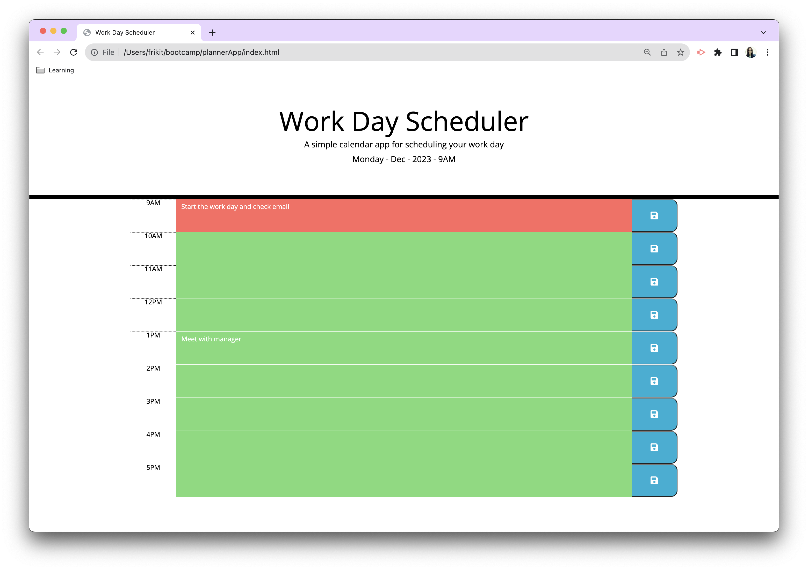
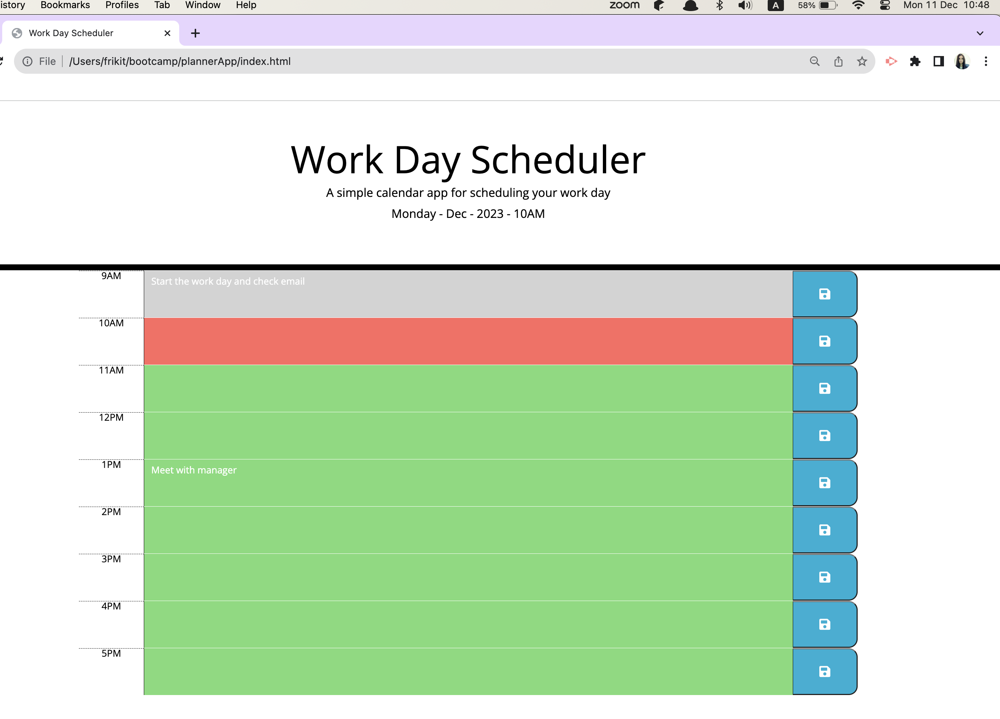
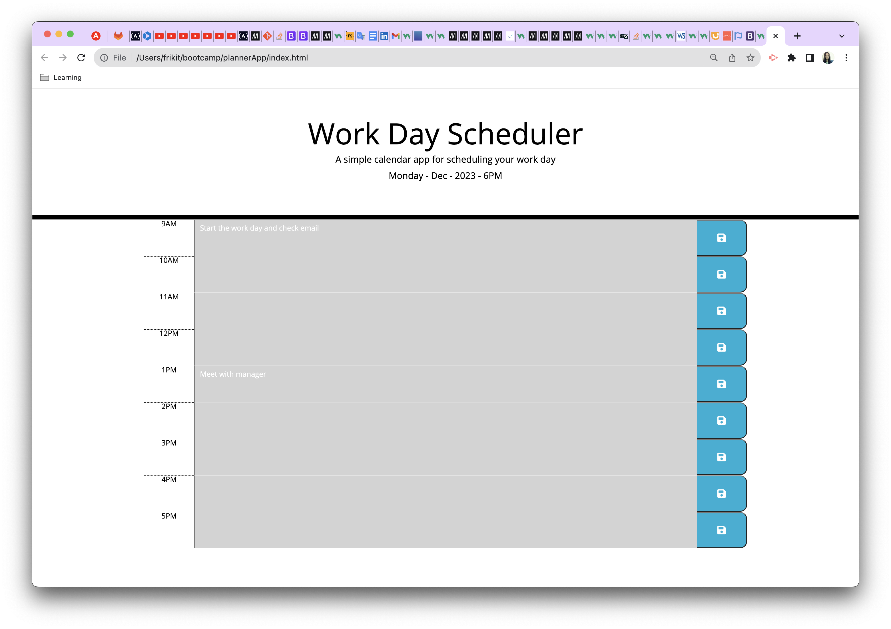

# plannerApp

In this challenge I create a simple calendar application that allows a user to save events for each hour of the day.

 ## Table of content

 During this project I worked with the following:

- [Description](#description)
  - [GitHub](#github)
  - [JavaScript](#javascript)
  - [Expected result](#expected-result)
  - [Result of project](#result-of-project)
  - [URLs](#urls)

# Description

For this project I used the Java Script language to create a planner app that contains the following requirements:

* When a user opens the planner display the current day at the top of the calender.
 
* Present timeblocks for standard business hours .
 
* The color-code each timeblock based on past, present, and future when the timeblock is viewed.
 
* A user can enter an event when they click a timeblock

* The event wil be saved in local storage when the save button is clicked in that timeblock.

* Between refreshes of a page Persist events.

## GitHub 

I created a new GitHub repo called `plannerAPP` then executed the following steps:
- git clone
- copy starter files `.html`, `.js`, `.css`.

## JavaScript

 I used JavaScript language to create both script.js and worked with :
 - `variables`
 - `loop`:
     - `for` (to be able to iterate through an array).
 - `conditional`:
     - `if` (to perform different actions based on different conditions).
 -  `day.js`
     - `.hour` (to get current hour).
     - `.format` (to get the formatted date).
 - `jQuery methods`: 
     - `.text`(to set the text content of the selected elements). 
     - `.attr` (to add an atribute).
     - `.addClass`(adds one or more classes to the selected elements).
     - `.on`(to create an event listener ).
 - `Local Storage`:
     - `.setItem` (to store data like in database by key and be able to retrieve and persist it for later usage).
     - `getItem`(to get the value of the specified local storage item)
     

## Expected result

## Result of project

On the screen you can see how website looks at different hours:
AT 9am the collor code shows present and future.
  

AT 10am the collor code shows past, present and future.
 
 
AT 6PM the collor code shows past.

## URLs

* The URL of the deployed application.

https://alinakristy.github.io/plannerApp/

* The URL of the GitHub repository. 

https://github.com/alinakristy/plannerApp

## License 
Apache License Version 2.0